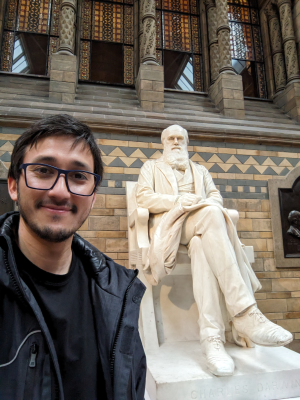

::: {.home-masthead .column-screen}
::: {.home-masthead__inner}
{.home-portrait alt="George G. Vega Yon con la escultura de Charles Darwin en el British Museum"}
:::
:::

::: {.home-hero}
[Científico computacional · Desarrollador de código abierto · Colaborador de investigación]{.home-kicker}

# George G. Vega Yon, Ph.D.

[Profesor Asociado de Investigación · División de Epidemiología, Universidad de Utah]{.home-hero-role}

[Desarrollo métodos rápidos y reproducibles, además de software científico, para comprender sistemas complejos en salud pública y otras áreas.]{.home-lede}

::: {.home-actions}
[Explorar mi investigación](research.qmd){.home-button .home-button--primary}
[Ver software científico](software.qmd){.home-button .home-button--secondary}
[Descargar CV académico](../cv/cv.pdf){.home-button .home-button--text}
:::
:::

::: {.home-proof aria-label="Aspectos destacados de la trayectoria"}
::: {.home-proof__item}
[10+]{.home-proof__value}

[años desarrollando software científico]{.home-proof__label}
:::
::: {.home-proof__item}
[Ph.D.]{.home-proof__value}

[Bioestadística · University of Southern California]{.home-proof__label}
:::
::: {.home-proof__item}
[R · C++ · Python]{.home-proof__value}

[herramientas reproducibles y de alto rendimiento]{.home-proof__label}
:::
:::

::: {.home-section .home-about}
::: {.home-section__heading}
[Perfil]{.home-section__kicker}

## Métodos, software y salud pública aplicada
:::

::: {.home-about__grid}
::: {.home-about__copy}
Soy Profesor Asociado de Investigación en la [División de Epidemiología de la Universidad de Utah](https://medicine.utah.edu/internalmedicine/epidemiology/){target="_blank" rel="noopener noreferrer"}, con cargos adjuntos en Ciencias de la Salud Poblacional y la Escuela Kahlert de Computación. Mi trabajo utiliza computación estadística para estudiar sistemas complejos, en particular problemas de ciencia de redes y epidemiología computacional.

Durante más de una década he convertido preguntas de investigación exigentes en software confiable para computación de alto rendimiento, visualización de datos, análisis de redes sociales y modelación basada en agentes. También integro IA moderna y flujos de trabajo agénticos cuando ayudan a que la investigación y el desarrollo de software sean más rigurosos, eficientes y útiles.
:::

::: {.home-credentials}
### Formación interdisciplinaria

- **Ph.D., Bioestadística** — University of Southern California, 2020
- **M.Sc., Economía** — California Institute of Technology, 2015
- **M.A., Políticas Públicas** — Universidad Adolfo Ibáñez, 2011

[Leer el CV académico completo →](../cv/cv.pdf){.home-inline-link}
:::
:::
:::

::: {.home-section .home-expertise}
::: {.home-section__heading}
[Experiencia]{.home-section__kicker}

## Donde la computación se une a preguntas relevantes

Mi trabajo conecta profundidad metodológica con software que la comunidad científica puede usar en la práctica.
:::

::: {.home-card-grid}
::: {.home-card}
[01]{.home-card__index}

### Epidemiología computacional

Modelos basados en agentes, simulación y análisis escalables para enfermedades infecciosas y salud poblacional.

[Explorar investigación →](research.qmd){.home-card__link}
:::

::: {.home-card}
[02]{.home-card__index}

### Ciencia de redes

Modelos estadísticos y herramientas visuales para comprender relaciones, difusión y sistemas sociales complejos.

[Ver publicaciones →](research.qmd){.home-card__link}
:::

::: {.home-card}
[03]{.home-card__index}

### Software científico

Herramientas abiertas en R, C++ y Python diseñadas para rendimiento, reproducibilidad y facilidad de uso.

[Ver portafolio de software →](software.qmd){.home-card__link}
:::
:::
:::

::: {.home-collaboration .column-screen}
::: {.home-collaboration__inner}
::: {.home-collaboration__copy}
[Colaboración]{.home-section__kicker}

## Convirtamos preguntas complejas en herramientas computacionales robustas.

Estoy disponible para colaboraciones y consultorías seleccionadas en ciencia de datos, ciencia de redes, software científico, visualización y flujos de investigación apoyados por IA/LLM.
:::

::: {.home-actions}
[Conversar sobre una colaboración](https://www.linkedin.com/in/georgevegayon/){.home-button .home-button--light target="_blank" rel="noopener noreferrer"}
[Ver proyectos de software](software.qmd){.home-button .home-button--outline-light}
:::
:::
:::

::: {.translation-note}
*Esta versión del sitio web fue traducida automáticamente de la versión original en inglés usando GitHub Copilot y aún no ha sido verificada por un humano.*
:::
