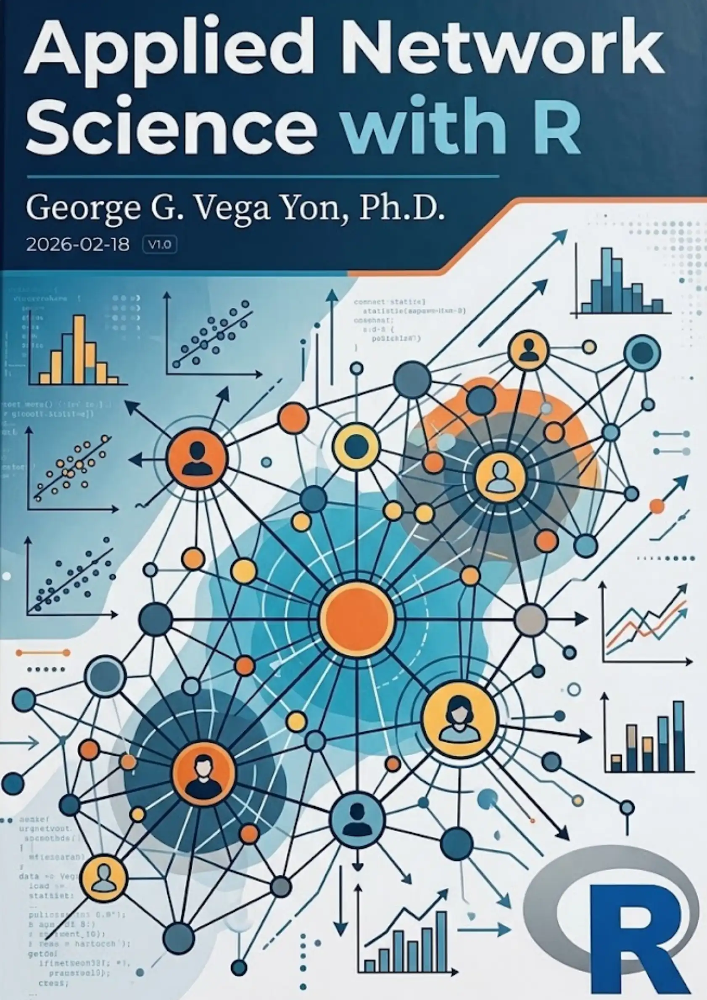
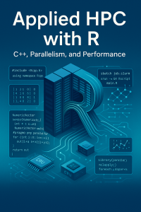

Soy un educador dedicado que disfruta compartir conocimiento y fomentar un ambiente de aprendizaje abierto e inclusivo. La mayor parte de mi experiencia docente ha sido en las áreas de ciencia de datos, estadística y ciencia de redes. Comprometido con la ciencia abierta, me aseguro de que todos mis contenidos educativos estén disponibles gratuitamente en línea.

## Libros

::: {.columns style="align-items: center;"}
::: {.column width="20%"}
{width=80% fig-alt="Portada del'libro "Ciencia de Redes Aplicada con R'"}
:::
::: {.column width="80%"}
### Ciencia de Redes Aplicada con R

El libro es una colección de presentaciones, talleres y tutoriales que he desarrollado a lo largo de los años para enseñar ciencia de redes con R. El libro trata principalmente sobre modelos ERGM y procesamiento de datos de redes. El libro fue escrito completamente en quarto, lo que lo hace completamente reproducible.

Sitio web del libro: <https://book.ggvy.cl> 
Versión en español: <https://book.ggvy.cl/es>
:::
:::

::: {.columns style="align-items: center;"}
::: {.column width="20%"}
{width=80% fig-alt="Portada del libro 'HPC Aplicada con R'"}
:::
::: {.column width="80%"}
### HPC Aplicada con R

Este libro proporciona una visión general práctica de cómo acelerar el código R. Con un enfoque en computación paralela y escritura de código R eficiente, el libro también proporciona una introducción sobre cómo usar R en entornos HPC con el paquete slurmR de R y ejemplos listos para usar con C++ a través de Rcpp.

Sitio web del libro: <https://book-hpc.ggvy.cl> 
Versión en español: <https://book-hpc.ggvy.cl/es>
:::
:::

::: {.columns style="align-items: center;"}
::: {.column width="20%"}
{width=80% fig-alt="Portada del libro 'AI for the Scientist in a Hurry'"}
:::
::: {.column width="80%"}
### AI for the Scientist in a Hurry

Notas y reflexiones sobre inteligencia artificial, escritas para científicos que necesitan ponerse al día rápidamente. El libro cubre conceptos y herramientas de IA prácticos y relevantes para la investigación, con un enfoque en construir intuición rápidamente.

Sitio web del libro: <https://book-ai.ggvy.cl> 
Versión en español: <https://book-ai.ggvy.cl/es>
:::
:::

## Cursos

- **PHS 7045: Programación Avanzada con R y HPC** (Universidad de Utah, Programas de Posgrado) ([enlace](https://github.com/UofUEpiBio/PHS7045-advanced-programming/tree/spring-2023){target="_blank"}): Co-diseño e imparto esta clase con mi colega el Dr. Jonathan Chipman para estudiantes de posgrado en el Departamento de Ciencias de Salud Poblacional de la Universidad de Utah.

- **PM 566: Introducción a la Ciencia de Datos en Salud** (USC, Programas de Posgrado) ([enlace](https://github.com/USCbiostats/PM566/tree/fall2021){target="_blank"}): Co-diseñé esta clase con profesores de la División de Bioestadística de USC como la clase introductoria al programa de Maestría en Ciencia de Datos en Salud de USC.

## Talleres y Tutoriales

Puede encontrar una lista completa de mis talleres y tutoriales en la sección de [charlas](talks.qmd) de mi sitio web.

---

::: {style="font-size: 0.9em; color: #666; text-align: center; margin-top: 2em; padding: 1em; background-color: #f8f9fa; border-radius: 5px;"}
*Esta versión del sitio web fue traducida automáticamente de la versión original en inglés usando GitHub Copilot y aún no ha sido verificada por un humano.*
:::